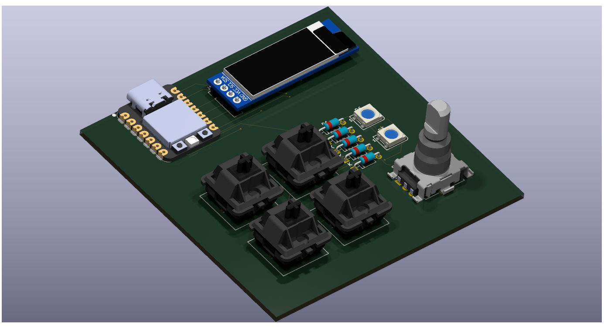
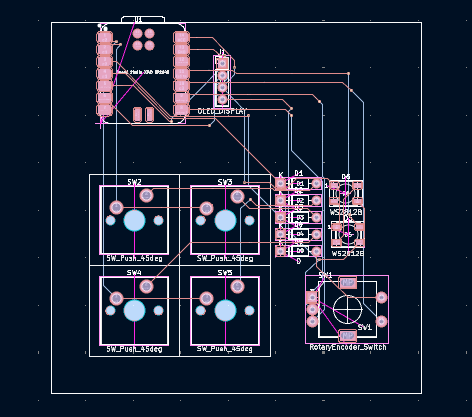
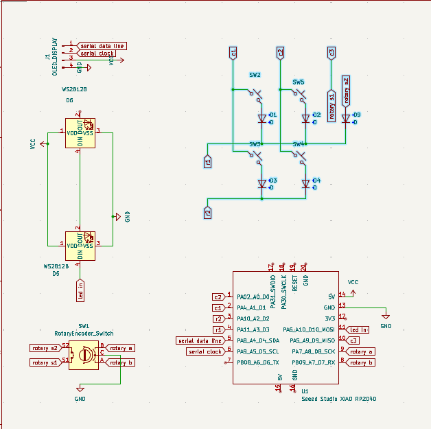
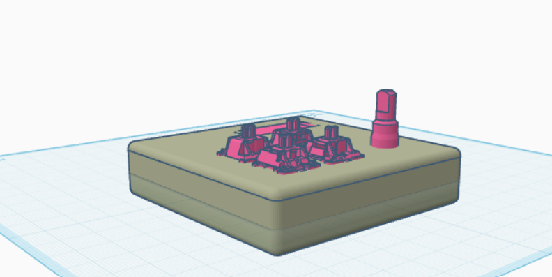

# DaVinci Resolve Macropad
this is a project that is developed for me to increase my efficency in video editing apps 

.png)

this macropad provides control through 4 switches and an encoder with switch gives feedback through the led and display and uses xiao Rp2040 as an MCU and it is a2x3 matrix of switches and this is a multi layered setup that switches modes based on encoder switch state 

I used kicad for schematics and pcb design and fusion and thinker cad for case design and hack club community helped a lot in this process 

This uses circuit python and kmk for firmware of the macropad 
I used pyhton to develop the firmware and kmk is a derivative of qmk that is easy to use

made with ❤️ for hack club

**Built by Mani Dev** • MIT License • Made for Hack Club  
[@0xmanidev](https://github.com/0xmanidev) • manikanta.vasamsetti.dev@gmail.com
